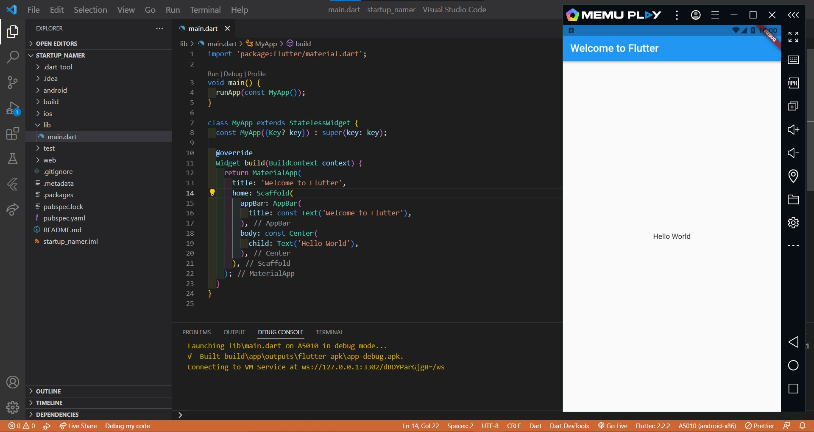
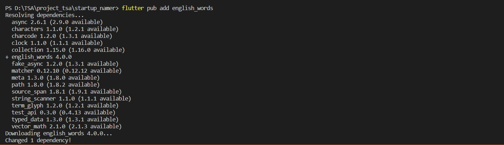
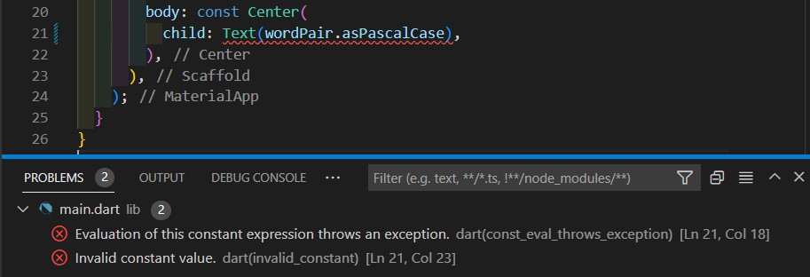
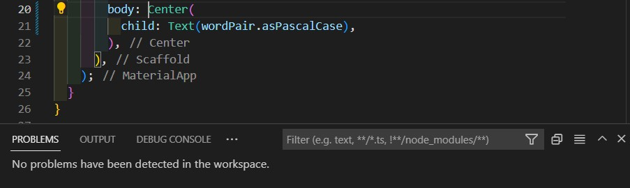
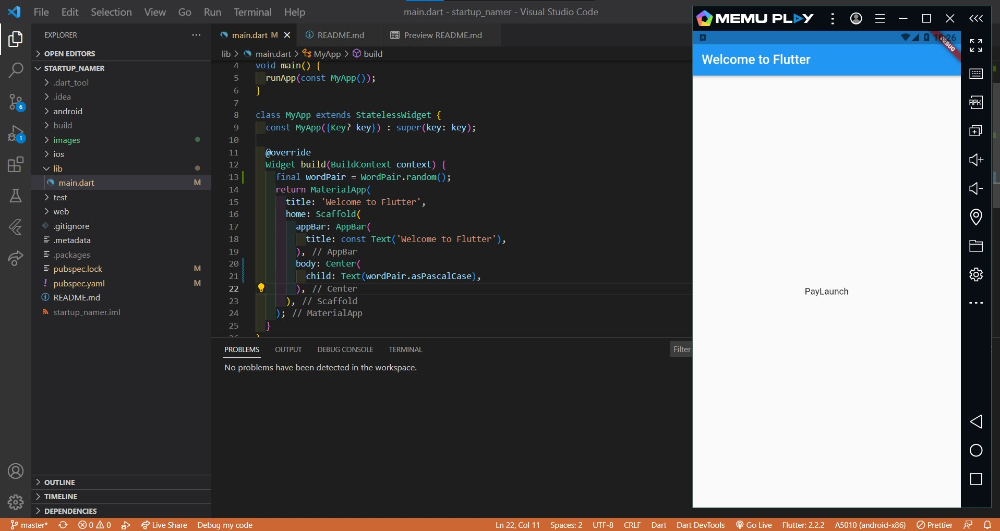
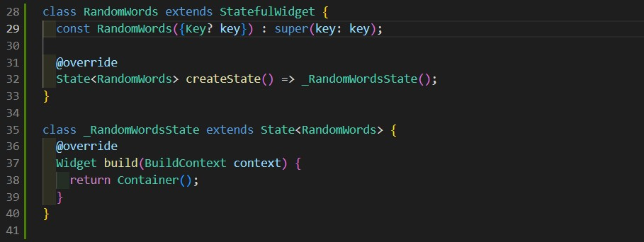
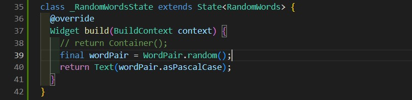
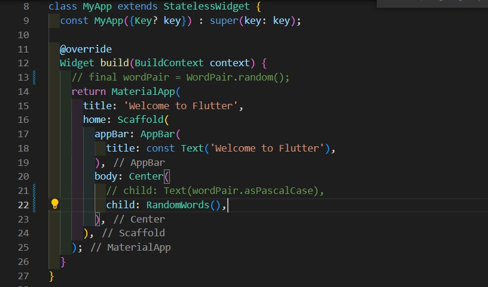
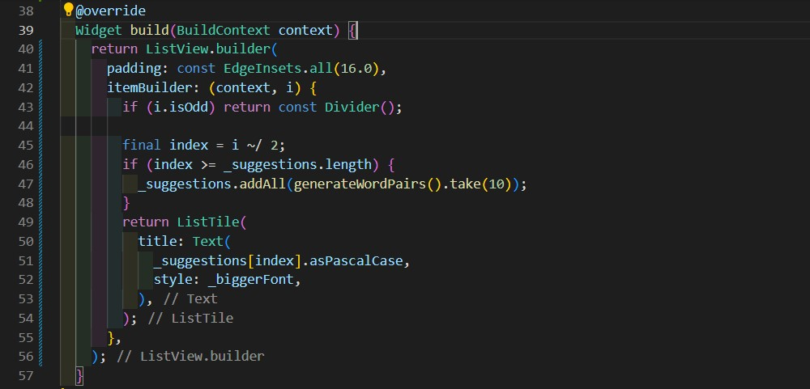
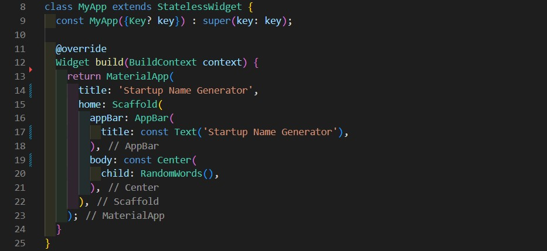

# startup_namer

Write your first Flutter app, part 1

## 3. Create the starter Flutter app

## 4. Use an external package

Menambahkan package `english_words`

Menggunakan package `english_words`

Terdapat error

Setelah diperbaiki

#### Output

Praktikum ini menggunakan class WordPair dari package `english_words` untuk menampilkan pasangan kata acak dengan properti `asPascalCase` untuk mengkapitalisasikan huruf depan setiap kata

## 5. Add a stateful widget

Menambahkan widget stateful `RandomWords` dan membuat class `_RandomWordsState`. 

Mengubah method `build()` di `_RandomWordsState`. 

Mengubah kode program pada `MyApp`. 

#### Output

Praktikum ini sama seperti praktikum sebelumnya, akan tetapi disini class `WordPair` dari package `english_words` disimpan di dalam stateful widget `RandomWords`.

## 6. Create an infinite scrolling ListView

Menambahkan variabel ke dalam class `_RandomWordsState` yaitu `_suggestions` untuk menyimpan pasangan kata yang disarankan dan `_biggerFontvariabel` untuk membuat ukuran font lebih besar.

Memperbarui method `build` pada class `_RandomWordsState` dengan menggunakan `ListView` 

Memperbarui method `build` pada class `MyApp` 

#### Output

